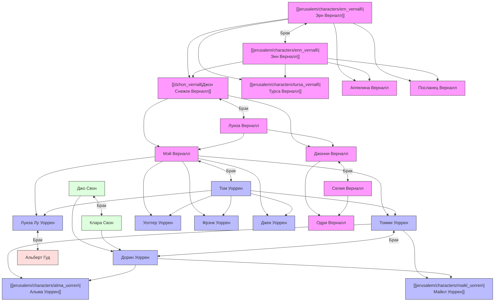

---
{"dg-publish":true,"dg-permalink":"jerusalem/artifacts/rodoslovnaya_vernallov_i_uorrenov","permalink":"/jerusalem/artifacts/rodoslovnaya_vernallov_i_uorrenov/","dg-note-properties":{"type":"artifact","timeslot_start":1715,"timeslot_end":2006}}
---

Генеалогическая схема объединяет два ключевых семейства романа Алана Мура «Иерусалим» — **Верналлов** (семейство провидцев, архитекторов и безумцев) и **Уорренов** (выходцев из рабочего класса Боро). В ней отражены пять поколений персонажей, их родственные связи, браки и наследование таинственного дара многомерного восприятия.

### Генеалогический граф (Mermaid)

---

### Анализ поколений и персонажей

#### Поколение 1 (Прапрадедушка и прапрабабушка)
*   **[[jerusalem/characters/ern_vernall\|Эрн Верналл]]** (Эрнест / «Рыжий» Верналл) — нортгемптонский маляр-декоратор. Около 1715 года во время реставрации под самым куполом [[jerusalem/locations/sobor_svyatogo_pavla\|Собора Святого Павла]] в Лондоне пережил грандиозное четырехмерное откровение, лишившее его привычного земного рассудка и полностью обесцветившее его волосы (за что получил прозвище Снежок). Стал первым в роду, кто обрел пророческий дар видения Вечности. Скончался в Бедламе в 1882 году в возрасте 49 лет.
*   **[[jerusalem/characters/enn_vernall\|Энн Верналл]]** — супруга Эрна, мать их детей. Беспокоилась о выживании семьи в нищете и душевном здоровье мужа.

#### Поколение 2 (Прадедушка, его сестры и братья)
*   **[[jerusalem/characters/dzhon_vernall\|Джон (Джонни / «Снежок») Верналл]]** — сын Эрна и Энн. Родился рыжим, но унаследовал дар отца и побелел головой уже в десятилетнем возрасте. Работал кровельщиком и верхолазом на крышах Боро, следил за дымовыми трубами (трактовал дымоход как тор — центральную фигуру космоса). Женился на Луизе Верналл.
*   **[[jerusalem/characters/tursa_vernall\|Турса Верналл]]** — дочь Эрна и Энн. Эксцентричная уличная аккордеонистка, извлекавшая из инструмента какофоническую музыку и низкие громоподобные ноты, пытаясь совладать с каскадным раскатом дробящихся эхо в Душе.
*   **Аппелина Верналл** — младшая дочь Эрна и Энн, родившаяся после событий 1865 года.
*   **Посланец Верналл** — младший сын Эрна и Энн.

#### Поколение 3 (Бабушки, дедушки и их кузены)
*   **Мэй Уоррен** (в девичестве Мэй Верналл) — дочь Джона (Снежка) и Луизы. Известная «смертоведка» на Зеленой улице в Боро, помогавшая людям приходить в этот мир и уходить из него. Женщина внушительной комплекции, обладавшая суровым и грозным характером. Вышла замуж за Тома Уоррена.
*   **Джонни Верналл** — сын Джона (Снежка) и Луизы, младший брат Мэй. Руководитель танцевального ансамбля в послевоенные годы, бредивший музыкальной сценой. Женился на Селии.
*   **Джо Свон** — жизнерадостный широкоплечий лодочник, дедушка Альмы по материнской линии. Умер от туберкулеза, заработанного во время работы на баржах. Женился на Кларе Свон.
*   **Клара Свон** (в девичестве Верналл) — бабушка Альмы по материнской линии, мать Дорин Уоррен. Строгая, но справедливая женщина благородных манер, бывшая служанка в Олторп-Хаусе.

#### Поколение 4 (Родители главных героев, их дяди и тети)
*   **Дети Мэй Верналл и Тома Уоррена**:
    *   **Томми Уоррен** (Томас Уоррен) — отец Альмы и Майкла. Работал на пивоварне, прошел Первую мировую войну. Обладал скромным и начитанным характером, интересовался историей. Женился на Дорин Свон.
    *   **Луиза «Лу» Гуд** (в девичестве Уоррен) — дочь Мэй и Тома, тетя Альмы и Майкла. Вышла замуж за Альберта Гуда. Направляла Томми советами в молодости.
    *   **Уолтер «Уолт» Уоррен** — сын Мэй и Тома, дядя Альмы и Майкла, торговец на черном рынке.
    *   **Фрэнк Уоррен** — младший сын Мэй и Тома.
    *   **Джек Уоррен** — сын Мэй и Тома, погиб на Первой мировой войне во Франции, что стало глубокой трагедией для всей семьи.
*   **Дети Джонни Верналла и Селии**:
    *   **Одри Верналл** — дочь Джонни и Селии, двоюродная сестра Томми Уоррена. Талантливая аккордеонистка в ансамбле своего отца. После семейной трагедии сошла с ума и была навсегда помещена в психиатрическую лечебницу Святого Криспина у Берри-Вуд.
*   **Дорин Уоррен** (урожденная Свон) — дочь Джо Свона и Клары, супруга Томми Уоррена, мать Альмы и Майкла. Скончалась от рака кишечника в 1995 году.

#### Поколение 5 (Главные герои)
*   **[[jerusalem/characters/alma_uorren\|Альма Уоррен]]** — дочь Томми и Дорин. Пятилетняя девочка в прелюдии романа, впоследствии ставшая известной нортгемптонской художницей. В своем творчестве (в частности, в картине «Неоконченный труд») запечатлела многомерные видения из клинической смерти своего брата и детских снов.
*   **[[jerusalem/characters/maikl_uorren\|Майкл Уоррен]]** (Мик / Уорри / Могучий Майк) — младший сын Томми и Дорин. В феврале 1959 года в трехлетнем возрасте задохнулся, подавившись вишнево-ментоловой конфетой «Песенка», но вернулся к жизни через день после удара Могучего Майка (ангела-зодчего) на небесном бильярдном столе в Душе. Во взрослом возрасте работал на утилизации стальных баков, где пережил повторную клиническую смерть, всколыхнувшую его забытые воспоминания о Запределье.
